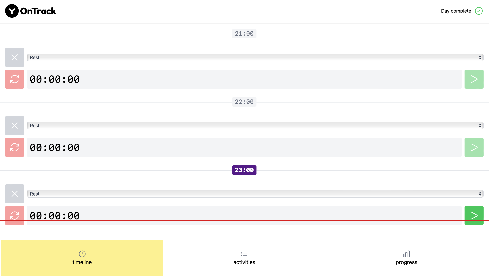
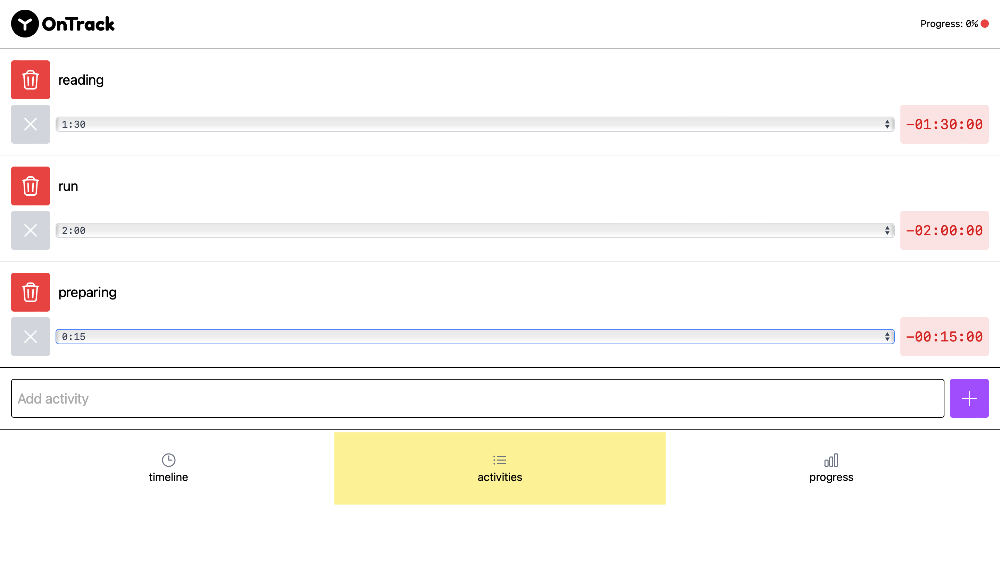
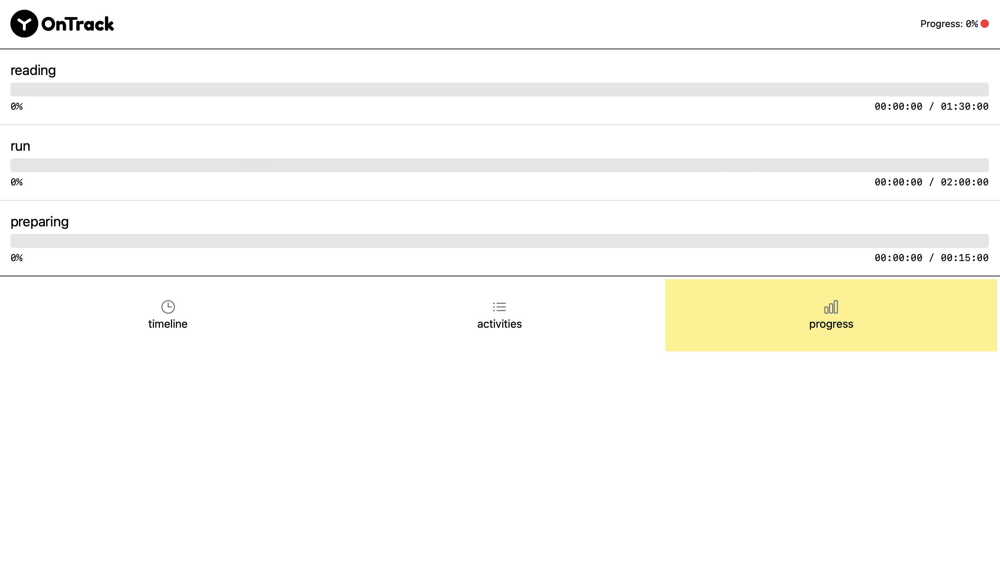

# 📝 ToDoList App — Vue 3 + Vite

A simple and elegant ToDo List application built with **Vue 3**, **Composition API**, and **Vite**. Manage your daily tasks easily and efficiently.

## 🚀 Features

- ✅ Add, complete, and delete tasks
- 🧠 Responsive and clean UI
- 💾 LocalStorage support to save your tasks
- ⚡️ Built with Vite for fast development

## 🖥️ Preview





## 📦 Tech Stack

- [Vue 3](https://vuejs.org/)
- [Vite](https://vitejs.dev/)
- [JavaScript](https://developer.mozilla.org/en-US/docs/Web/JavaScript)
- [CSS3](https://developer.mozilla.org/en-US/docs/Web/CSS)

## ⚙️ Project Setup

```bash
# 1. Clone the repo
git clone https://github.com/asylbekuly/ToDoList-App-Vue3.git

# 2. Move to project directory
cd ToDoList-App-Vue3

# 3. Install dependencies
npm install

# 4. Run the app
npm run dev
